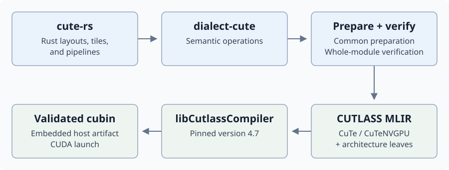

# FP16 GEMM with CuTe on SM100

Two thread blocks (CTAs) work together on each 256 × 352 output tile. The
kernel uses Rust types to describe tile layouts, TMA copies, and matrix
multiply-and-accumulate (MMA) operations.

```text
C[M, N] = A[M, K] @ B[N, K].T + bias[M, 1]  # bias is optional
```

- A, B, C, and bias are FP16; multiplication accumulates in FP32.
- `--has-bias` adds one value per output row before conversion to FP16.
- All four typed TMA descriptors use `#[grid_constant]` parameters. The host
  passes their 128-byte values directly, without allocating descriptor buffers
  in device global memory.
- The compiler keeps the layout and pipeline information when producing GPU code:



## Tile and pipeline

```text
                 one 256 × 352 output tile
                 192 columns       160 columns
               ┌─────────────────┬────────────────┐
CTA 0: 128 rows │                 │                │
               ├─────────────────┼────────────────┤
CTA 1: 128 rows │                 │                │
               └─────────────────┴────────────────┘
                 two-CTA MMA pair; A collector reused

A/B global ──cluster TMA──▶ shared [5 stages] ──MMA──▶ TMEM
C global   ◀─────TMA────── shared [2 stages] ◀──FP16 + bias──┘
```

- **Cooperative MMA:** 256×192 and 256×160 outputs share A for each K16
  instruction pair; each mainloop stage covers K64.
- **Warp roles:** each CTA has 192 threads: four epilogue warps, one MMA
  warp, and one TMA warp.
- **Input pipeline:** five shared stages overlap cluster TMA and MMA.
  Every lane of the producer warp participates in each native CuTe copy.
- **Accumulator and epilogue:** 512 TMEM columns, then eleven 128×32 slices
  per CTA; bias/conversion and vector stores feed two shared C stages.
- **Persistent schedule:** clusters visit tiles in M-first order. The host
  uses the smaller of tile count and resident capacity; `--clusters` overrides it.
- **Shared memory:** 211,072 bytes per CTA, aligned to 1,024 bytes. Host
  tensor maps and device tiles use the same Rust layout types:

| Layout | Shared tile (rows × columns) | TMA swizzle |
| --- | --- | --- |
| `ASmem` | 128 × 64 | 128 bytes |
| `B0Smem` | 96 × 64 | 128 bytes |
| `B1Smem` | 80 × 64 | 128 bytes |
| `CSmem` | 128 × 32 | 64 bytes |

## Build and run

Requirements: an SM100 GPU, a compatible CUDA driver, and the repository's
configured cuda-oxide toolchain. The default comparison also needs the local
CuTe DSL assets and Python environment described below. From the repository root:

```bash
cargo oxide toolchain install cutlass
export CUDA_OXIDE_DEVICE_BACKEND=cutlass-mlir
cargo oxide build fp16_gemm_256x352_cute --arch sm_100a

# Verify and compare CuTe DSL and cuda-oxide; print two performance lines.
cargo oxide run fp16_gemm_256x352_cute --arch sm_100a

# Rust only: exactly one kernel launch; verify its output afterward.
cargo oxide run fp16_gemm_256x352_cute --arch sm_100a -- \
  --rust-only --mnk 256,352,64 --timing-mode direct --warmup 0 --iters 1

# Rust only: N/K tails, row bias, persistent tiles, and five-stage ring reuse.
cargo oxide run fp16_gemm_256x352_cute --arch sm_100a -- \
  --rust-only --mnk 512,712,392 --has-bias --clusters 1 \
  --timing-mode direct --warmup 0 --iters 1
```

- M must be a positive multiple of **256**; N and K, of **8**.
  TMA handles partial N352 and K64 tiles.
- The default comparison uses `256,352,64`, 25 warmup launches, and 100 timed
  samples per implementation. Override these with `--mnk`, `--warmup`, and `--iters`.
- `--rust-only` checks every output against CPU FP32 accumulation rounded to
  FP16 (`atol=0.1`, `rtol=1e-5`) and prints its JSON report. Large shapes make
  this CPU check expensive.
- Rust-only timing defaults to **graph**, with `--graph-launches` launches per
  sample. The standalone commands above explicitly use **direct**: one kernel
  per CUDA-event pair, with no graph capture.
- `--warmup 0 --iters 1` in direct mode launches each selected implementation
  once total and verifies that timed output. Setup and verification are outside
  the event interval.
- `--json result.json` saves the combined comparison report by default, or the
  standalone cuda-oxide report with `--rust-only`. `--help` lists all options.

## Compare with CuTe DSL

Normal execution invokes the separately supplied local `compare.py` and
`reference/` assets; these remain ignored and are not included in a clean
checkout. The Python environment needs `nvidia-cutlass-dsl[cu13]==4.7.0`,
CUDA-enabled PyTorch, CUDA Python, and NumPy.

The executable selects Python in this order: `--python PATH`,
`CUDA_OXIDE_CUTE_PYTHON`, this example's `.venv/bin/python`, then `python3` on
`PATH`. Placing the environment in `cuteir/examples/fp16_gemm_256x352_cute/.venv`
lets the default command find it automatically. To select another environment
and save results for a larger shape:

```bash
cargo oxide run fp16_gemm_256x352_cute --arch sm_100a -- \
  --python /path/to/venv/bin/python \
  --mnk 8192,8096,8192 --warmup 100 --iters 31 --json /tmp/gemm-comparison.json
```

The comparison verifies both outputs on identical inputs and prints two lines:

```text
CuTe DSL: <time> us, <rate> TFLOP/s
cuda-oxide: <time> us, <rate> TFLOP/s
```

The `256x352` in the example name is the **output tile shape**. `--mnk`
sets the full problem size. The default `256,352,64` run does little work and
is sensitive to launch overhead; the large shape above measures a different
workload. TFLOP/s is calculated from `2 × M × N × K` and the measured time.

Both times are medians of direct CUDA-event samples on the same GPU, with
matching warmup and iteration counts and one launch per sample. CuTe DSL runs
first, then cuda-oxide. The event intervals include any gaps in submitting GPU
work, and clock or power changes can affect the comparison. Use `--rust-only`
for graph timing.

Diagnostics go to stderr. `--json` saves both measurements, verification
results, and the device and timing settings. Missing comparison assets or
Python dependencies cause an error; `--rust-only` runs without them.

## Rust API example

These declarations are taken from [the kernel](src/kernel.rs). The layout
parameters bind shared operands, tensor maps, and the paired MMA dimensions:

```rust
use cute_rs::{Composed, RowMajor, Sm100TiledMma, Sm100TmaMmaPipeline, Swizzle};

type ASmem = Composed<Swizzle<3, 3, 3>, 0, RowMajor<128, 64>>;
type B0Smem = Composed<Swizzle<3, 3, 3>, 0, RowMajor<96, 64>>;
type B1Smem = Composed<Swizzle<3, 3, 3>, 0, RowMajor<80, 64>>;
type TiledMma = Sm100TiledMma<ASmem, B0Smem, B1Smem, 192, 160>;
type MainloopPipeline = Sm100TmaMmaPipeline<5, 77_824>;
```

The kernel takes typed references:

```rust
#[grid_constant] a: &TmaDesc<f16, ASmem>
```

The generated host launcher accepts the descriptor **by value**:

```text
host descriptor -> 128 launch-argument bytes -> shared read-only descriptor
```

Each thread borrows the same descriptor storage. The element and layout types
stay explicit in the signature. Tensor data stays in device memory and must
remain live until GPU work completes; the unsafe host launch makes this
caller obligation explicit.

- [SM100 APIs](../../cute-rs/src/sm100.rs): `Sm100SharedTile`,
  `Sm100ClusterTmaCopy`, `Sm100TiledMma`, `Sm100TmemEpilogue`, and pipelines.
- [Host setup](src/main.rs): typed TMA descriptors, cluster launch, and validation.
- [Dialect operations](../../dialect-cute/src/sm100_ops.rs): layout, collector,
  and pipeline verification before lowering.

## Regression checks

[validate.py](validate.py) uses only Python's standard library and runs six
cases covering full tiles, bias, tails, persistent scheduling, and pipeline
phase changes. It invokes `--rust-only` to check CPU results and graph replay
output on Linux/SM100, without requiring the comparison assets or Python GPU
packages.

```bash
python cuteir/examples/fp16_gemm_256x352_cute/validate.py --sanitizer
```

- Build first; use `--binary PATH` if Cargo has a custom target directory.
- `--sanitizer` adds Compute Sanitizer memcheck/TMA and synccheck checks;
  omit it to run only the six cases.
